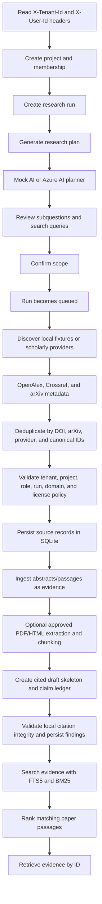

# Project Flow

## Current end-to-end flow

## API sequence

Send `X-Tenant-Id` and `X-User-Id` headers with project/run/evidence requests.
The deprecated `tenant_id` query parameter is only accepted when it matches
`X-Tenant-Id`.

1. `POST /api/v1/projects`
2. `POST /api/v1/projects/{project_id}/runs`
3. `POST /api/v1/projects/{project_id}/runs/{run_id}/plan`
4. `POST /api/v1/projects/{project_id}/runs/{run_id}/confirm-scope`
5. `POST /api/v1/projects/{project_id}/runs/{run_id}/execute-local`
6. `POST /api/v1/projects/{project_id}/runs/{run_id}/synthesize-local`
7. `POST /api/v1/projects/{project_id}/runs/{run_id}/validate-citations-local`
8. `POST /api/v1/projects/{project_id}/runs/{run_id}/evidence`
9. `POST /api/v1/projects/{project_id}/runs/{run_id}/search`
10. `GET /api/v1/projects/{project_id}/evidence/{evidence_id}`

## Current boundaries

The local vertical slice is functional through source discovery, canonical source
deduplication, source snapshots, passage records, evidence ingestion, claim-ledger
draft skeletons, citation-integrity findings, FTS5/BM25 search, local project membership checks, and
legal run-state transitions. By default `execute-local` uses
deterministic local fixtures and makes no external network calls. Set
`SOURCE_CONNECTOR=openalex` or launch with
`.\run_local.ps1 -SourceConnector scholarly_with_local_fallback` to discover
real OpenAlex, Crossref, and arXiv metadata and ingest available abstracts as
evidence. Results are deduplicated across providers before ingestion.
Cancelled and terminal runs cannot be revived by a later confirmation or worker
call.

Robots-aware crawling, semantic fact-checking, critical/safety review, background workers, reviewed report synthesis, and production Azure
storage/search integrations are not yet connected. The local
draft skeleton is not a reviewed or release-ready report.
