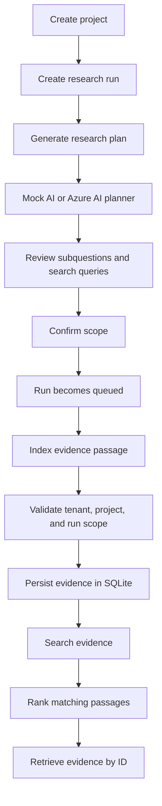

# Project Flow

## Current end-to-end flow

## API sequence

1. `POST /api/v1/projects`
2. `POST /api/v1/projects/{project_id}/runs`
3. `POST /api/v1/projects/{project_id}/runs/{run_id}/plan`
4. `POST /api/v1/projects/{project_id}/runs/{run_id}/confirm-scope`
5. `POST /api/v1/projects/{project_id}/runs/{run_id}/execute-local`
6. `POST /api/v1/projects/{project_id}/runs/{run_id}/evidence`
7. `POST /api/v1/projects/{project_id}/runs/{run_id}/search`
8. `GET /api/v1/projects/{project_id}/evidence/{evidence_id}`

## Current boundaries

The local vertical slice is functional through offline source discovery, evidence
ingestion, indexing, and keyword search. `execute-local` uses deterministic local
fixtures and makes no external network calls.
External source discovery, background workers, report synthesis, and production Azure
storage/search integrations are not yet connected.
